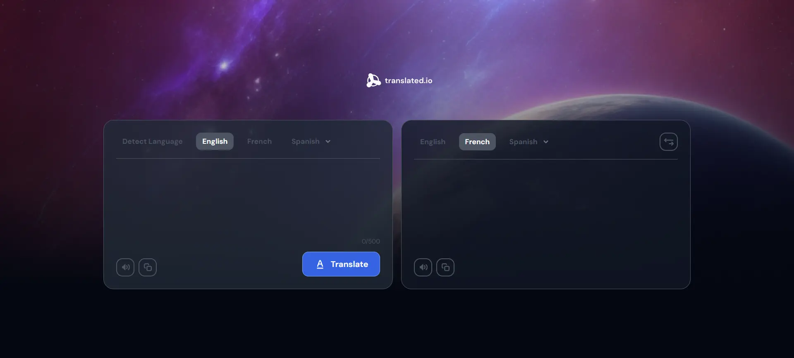

# Translate App - devChallenges.io Challenge

This project is the solution for the challenge called Traslate App from the [devChallenges.io](https://devchallenges.io/) website.



## Built with

- [Vite.js](https://vitejs.dev/) - React framework
- [React](https://reactjs.org/) - JS library
- [TypeScript](https://www.typescriptlang.org/) - Programming language

## Author

- Website - [Carlos Andres Spagnolo](https://spagnolo-carlos.netlify.app/)
- LinkedIn - [Carlos Andres Spagnolo](https://www.linkedin.com/in/carlos-spagnolo-andres/)
- Instagram - [@carlos.spagnolo.dev](https://www.instagram.com/carlos.spagnolo.dev/)
- Email - [carlos.andres.spagnolo@gmail.com](mailto:your.email@gmail.com)

## Cloning Repository

```bash
git clone https://github.com/SpagnoloCarlos/translate-app
cd translate-app
npm install
npm run dev
```

